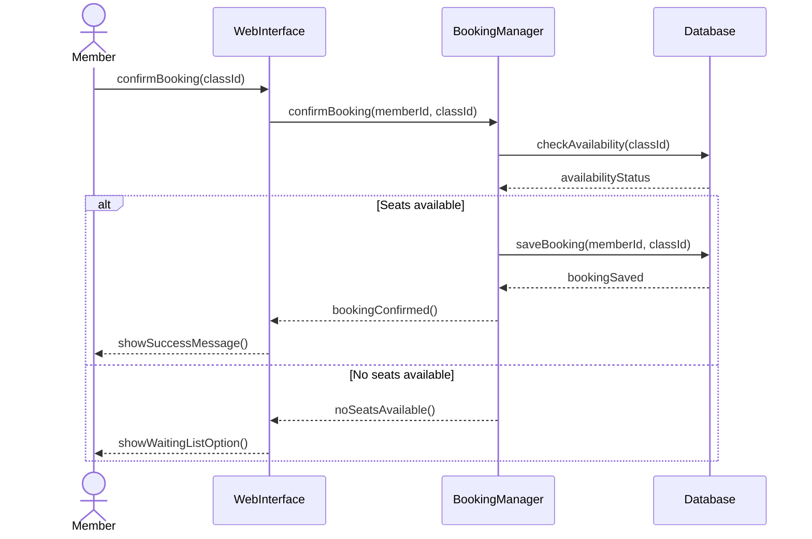
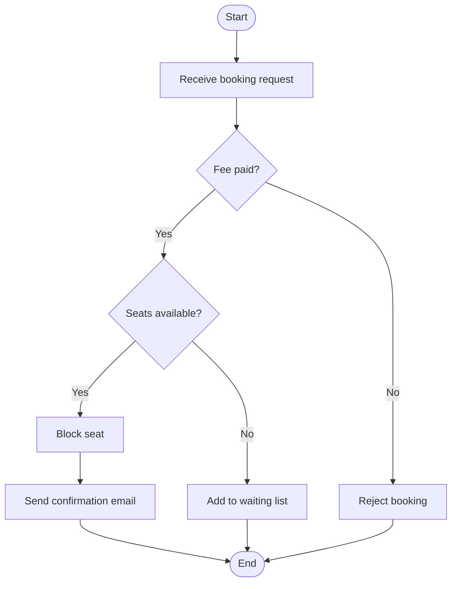
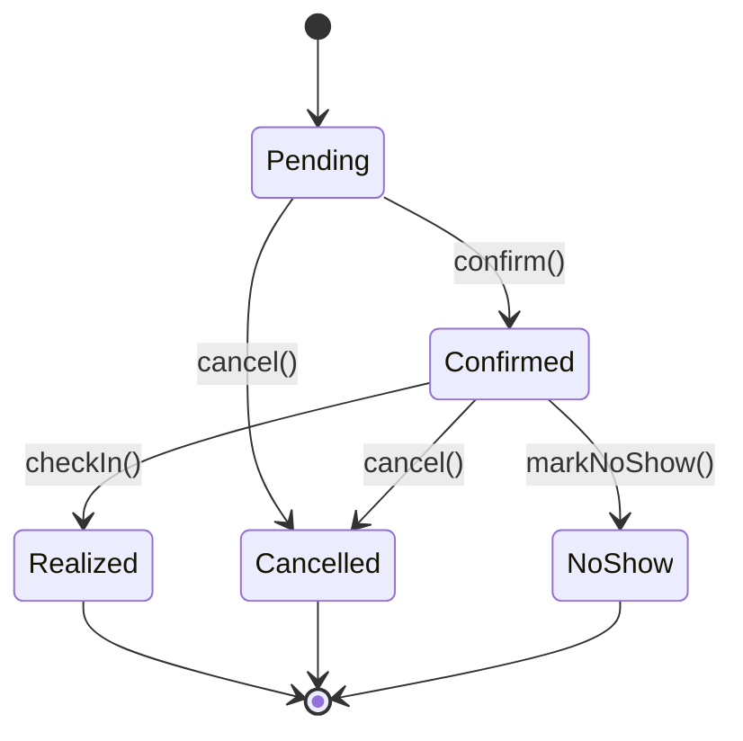

# Entornos de Desarrollo — Actividad 7.5
## Gestión de Clases Colectivas con Reserva Previa — GymMaster

Documentación técnica del módulo de gestión de clases colectivas mediante diagramas UML en Mermaid.


## Tarea 1 — Diagrama de Casos de Uso


## Tarea 2 — Diagrama de Secuencia: Confirmar Reserva



## Tarea 3 — Diagrama de Comunicación
```mermaid
graph LR

Member
WebInterface
BookingManager
Database

Member --> WebInterface
WebInterface --> BookingManager
BookingManager --> Database
Database --> BookingManager
BookingManager --> WebInterface
WebInterface --> Member
BookingManager --> WebInterface
WebInterface --> Member

1. Member → WebInterface : confirmBooking(classId)  
1.1 WebInterface → BookingManager : confirmBooking(memberId, classId)  
1.1.1 BookingManager → Database : checkAvailability(classId)  
1.1.2 Database → BookingManager : availabilityStatus  
1.2 BookingManager → WebInterface : bookingConfirmed()  
1.3 WebInterface → Member : showSuccessMessage()  

Flujo alternativo si no hay plazas:

1.2a BookingManager → WebInterface : noSeatsAvailable()  
1.3a WebInterface → Member : showWaitingListOption()  
```

## Tarea 4 — Diagrama de Actividades: Validación de Reserva


## Tarea 5 — Diagrama de Estados: Objeto Reservation

