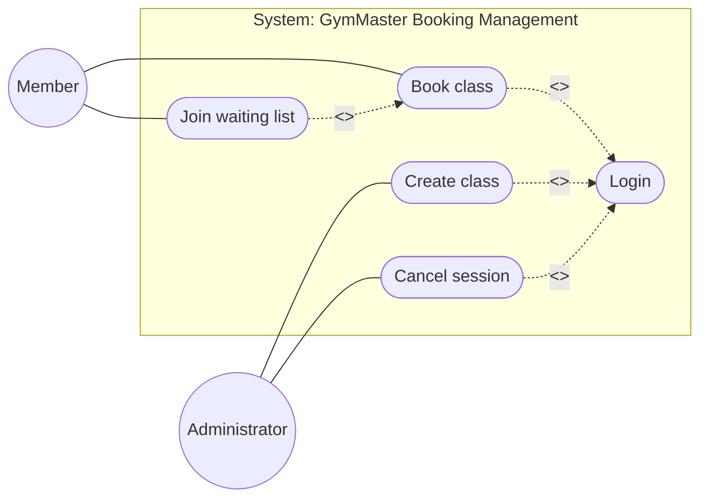

# Entornos de Desarrollo — Actividad 7.5
## Gestión de Clases Colectivas con Reserva Previa — GymMaster

Documentación técnica del módulo de gestión de clases colectivas mediante diagramas UML en Mermaid.

## Tarea 1 — Diagrama de Casos de Uso

## Tarea 2 — Diagrama de Secuencia: Confirmar Reserva

sequenceDiagram
    actor Member
    participant WebInterface
    participant BookingManager
    participant Database

    Member->>WebInterface: confirmBooking(classId)
    WebInterface->>BookingManager: confirmBooking(memberId, classId)
    BookingManager->>Database: checkAvailability(classId)
    Database-->>BookingManager: availabilityStatus

    alt Seats available
        BookingManager->>Database: saveBooking(memberId, classId)
        Database-->>BookingManager: bookingSaved
        BookingManager-->>WebInterface: bookingConfirmed()
        WebInterface-->>Member: showSuccessMessage()
    else No seats available
        BookingManager-->>WebInterface: noSeatsAvailable()
        WebInterface-->>Member: showWaitingListOption()
    end

## Tarea 3 — Diagrama de Comunicación
graph LR
    Member[":Member"]
    WebInterface[":WebInterface"]
    BookingManager[":BookingManager"]
    Database[":Database"]

    Member -->|1: confirmBooking(classId)| WebInterface
    WebInterface -->|1.1: confirmBooking(memberId, classId)| BookingManager
    BookingManager -->|1.1.1: checkAvailability(classId)| Database
    Database -->|1.1.2: availabilityStatus| BookingManager
    BookingManager -->|1.2: bookingConfirmed()| WebInterface
    WebInterface -->|1.3: showSuccessMessage()| Member

    BookingManager -->|1.2a: noSeatsAvailable()| WebInterface
    WebInterface -->|1.3a: showWaitingListOption()| Member

## Tarea 4 — Diagrama de Actividades: Validación de Reserva

flowchart TD
    A([Start]) --> B[Receive booking request]
    B --> C{Fee paid?}

    C -- Yes --> D{Seats available?}
    C -- No --> Z[Reject booking]

    D -- Yes --> E[Block seat]
    D -- No --> Y[Add to waiting list]

    E --> F[Send confirmation email]
    F --> G([End])

    Z --> G
    Y --> G

## Tarea 5 — Diagrama de Estados: Objeto Reservation

stateDiagram-v2
    [*] --> Pending

    Pending --> Confirmed: confirm()
    Pending --> Cancelled: cancel()

    Confirmed --> Cancelled: cancel()
    Confirmed --> Realized: checkIn()
    Confirmed --> NoShow: markNoShow()

    Realized --> [*]
    Cancelled --> [*]
    NoShow --> [*]

